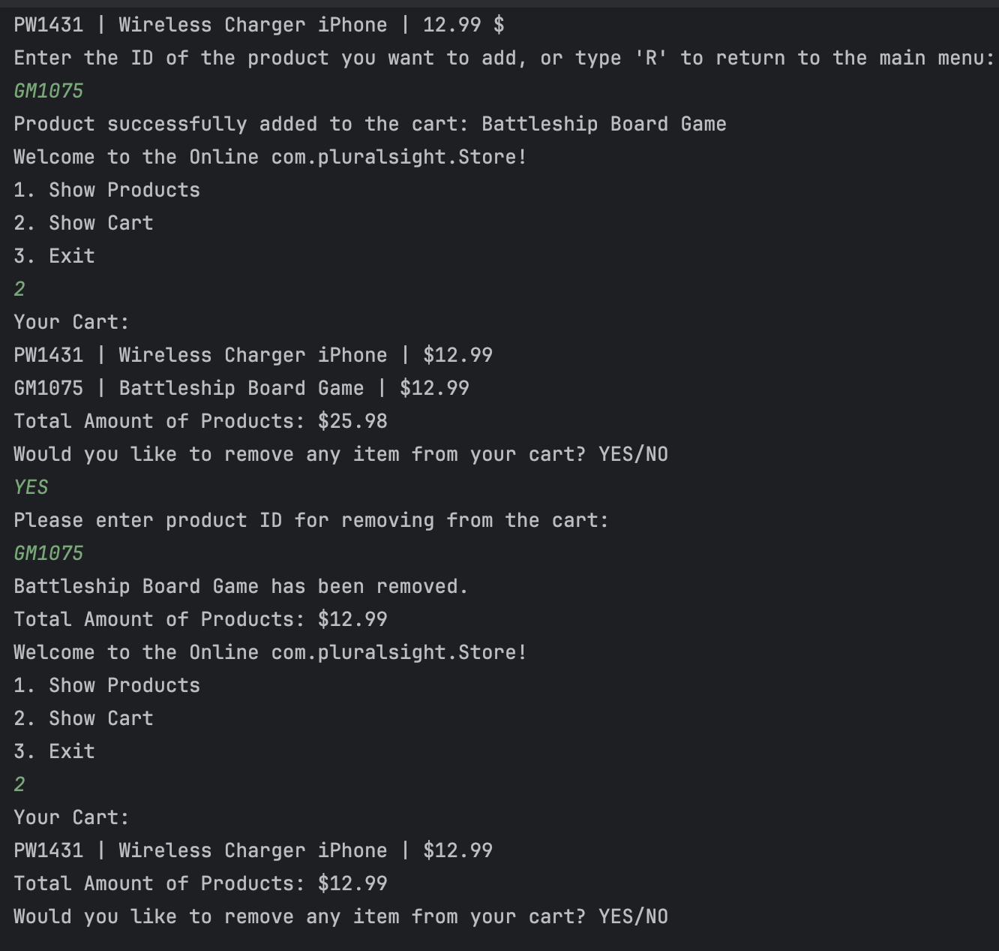
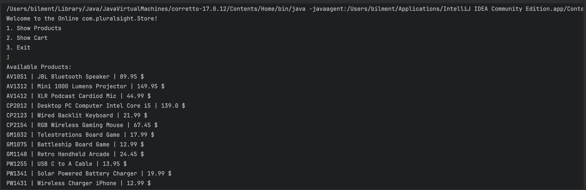

# Project Title

## Description of the Project

This project is about making a simple online store that you use through commands. Customers can look at products, add or remove items from their cart, and finish buying their items with a checkout process.

## User Stories

List the user stories that guided the development of your application. Format these stories as: "As a [type of user], I want [some goal] so that [some reason]."

- As a customer, I want to view the available products, so I can decide what to buy.
- As a customer, I want to filter products by their ID, so I can easily find and purchase specific items.
- As a customer, I want to add items to my cart, so I can gather all the products I wish to purchase in one place before checking out.
- As a customer, I want to be able to remove items from my cart, so I can exclude any products I no longer wish to buy before completing my purchase.
- As a customer, I want to be able to check out the items in my cart, so I can finalize my purchase and complete the transaction.

## Setup

Instructions on how to set up and run the project using IntelliJ IDEA.

### Prerequisites

- IntelliJ IDEA: Ensure you have IntelliJ IDEA installed, which you can download from [here](https://www.jetbrains.com/idea/download/).
- Java SDK: Make sure Java SDK is installed and configured in IntelliJ.

### Running the Application in IntelliJ

Follow these steps to get your application running within IntelliJ IDEA:

1. Open IntelliJ IDEA.
2. Select "Open" and navigate to the directory where you cloned or downloaded the project.
3. After the project opens, wait for IntelliJ to index the files and set up the project.
4. Find the Store class that contains the public static void main(String[] args) method.
5. Right-click on the Store class and select 'Run 'Store.main()'' to start the Online Store application.

## Technologies Used

- Java: Mention the version you are using.
- Any additional libraries or frameworks used in the project.

## Demo

addCart and Show 
removeCart 
showProduct 

## Future Work

Outline potential future enhancements or functionalities you might consider adding:

- Additional feature to be developed.
- Improvement of current functionalities.

## Resources

List resources such as tutorials, articles, or documentation that helped you during the project.

- https://yearup.brightspace.com/d2l/home
- https://www.w3schools.com/java/

## Team Members

- **Name 1** - Taha Bilmen

## Thanks

Express gratitude towards those who provided help, guidance, or resources:

- Thank you to Raymond for continuous support and guidance.
- A special thanks to all teammates for their dedication and teamwork.